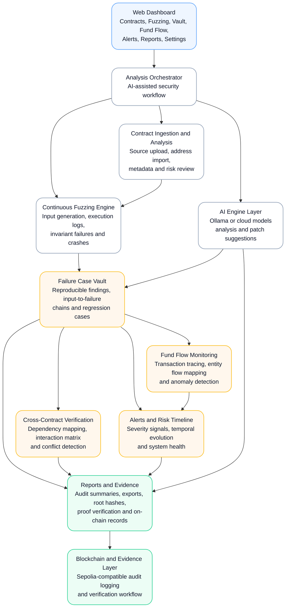
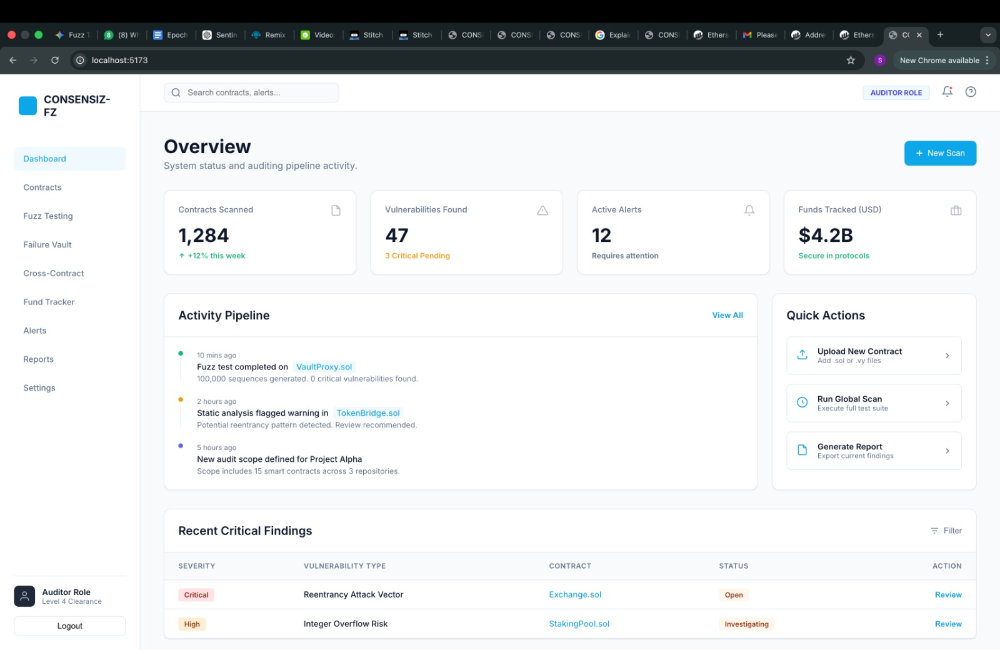
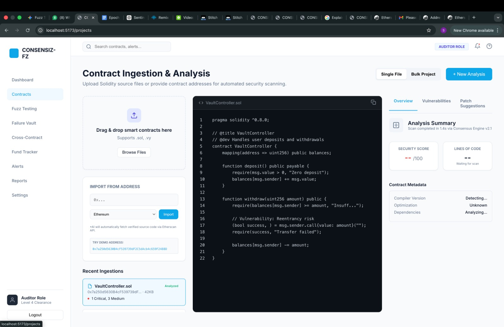
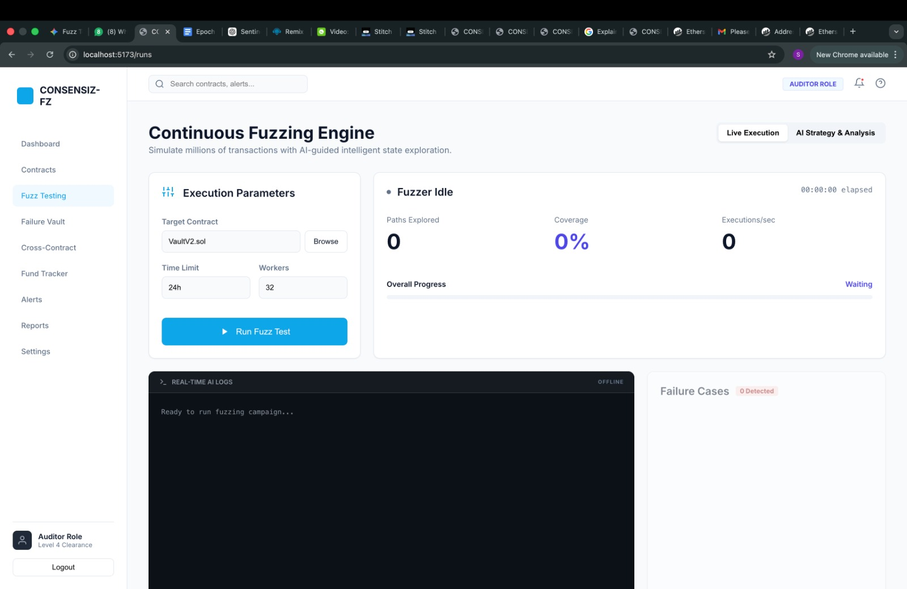
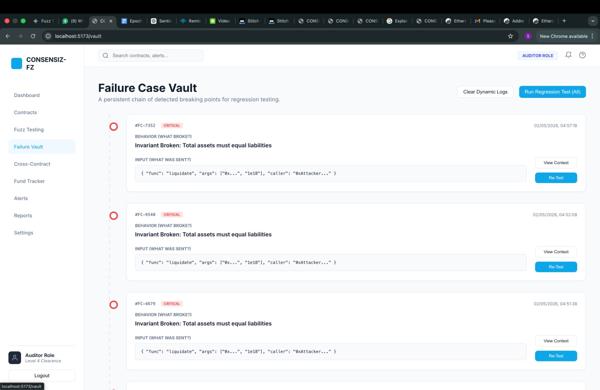
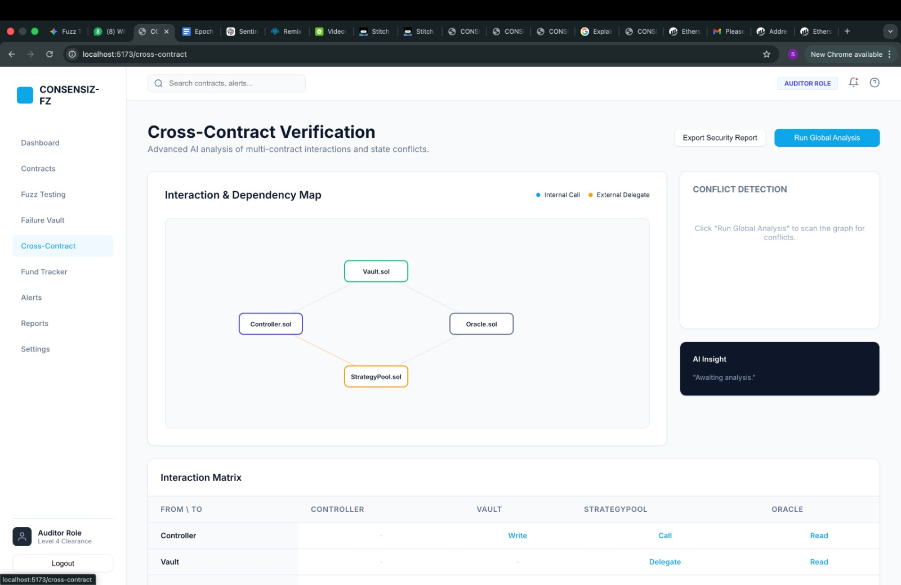
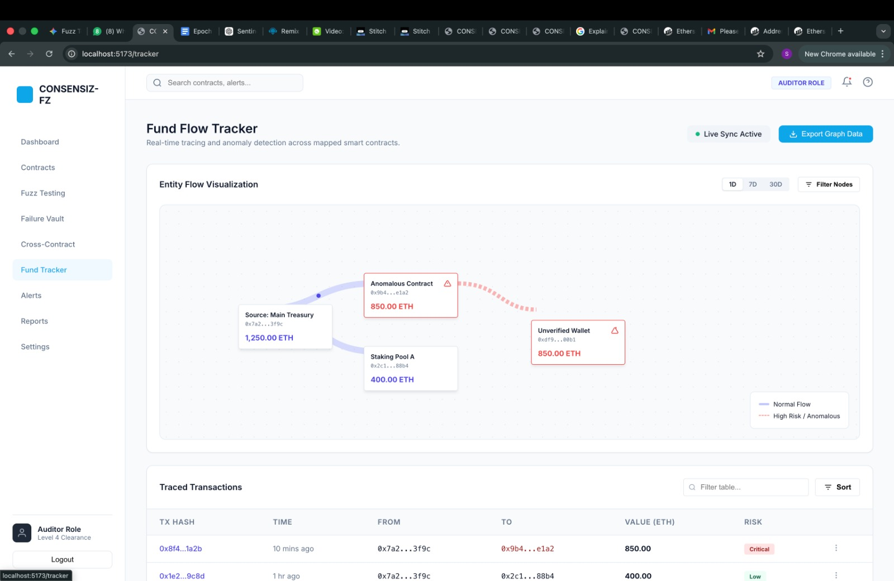
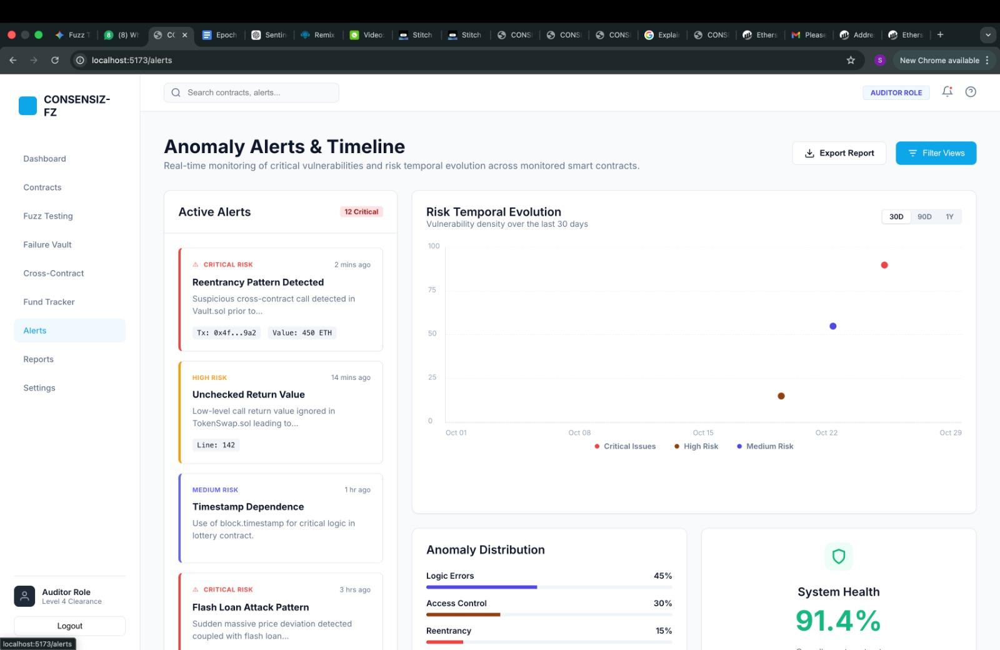
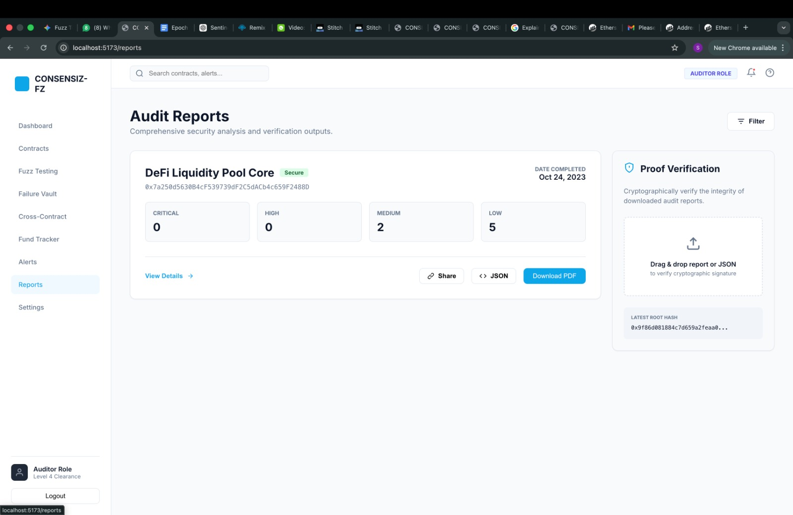
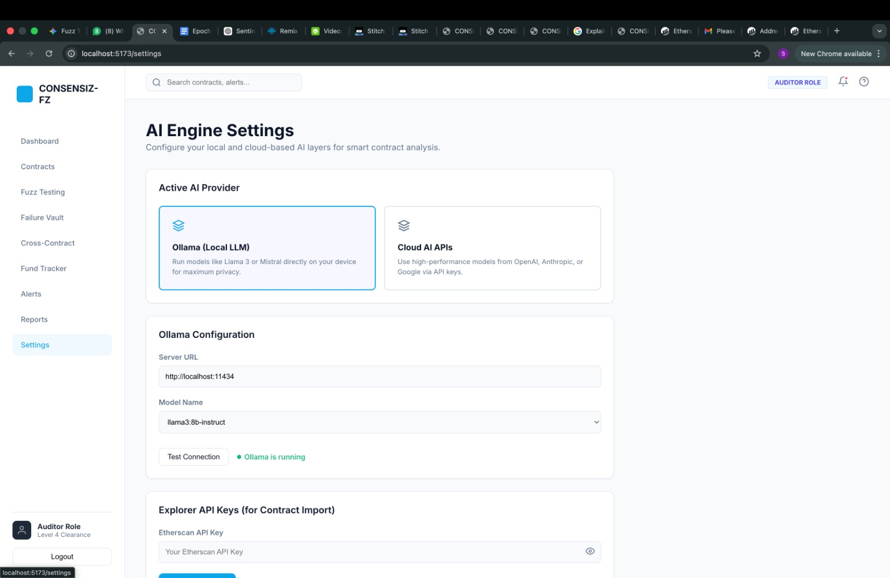

# Consensiz-FZ

**AI-assisted smart contract auditing, continuous fuzzing, and on-chain security evidence.**

Consensiz-FZ is a full-stack cybersecurity platform built for the **Epoch '26 Hackathon** in the **Blockchain and Cybersecurity** track.

The platform helps teams move beyond isolated smart contract checks by combining contract ingestion, AI-assisted analysis, continuous fuzz testing, failure-case persistence, cross-contract verification, fund-flow monitoring, anomaly detection, and auditable reporting in one workflow.

Instead of treating a failed fuzz test as an unreadable terminal log, Consensiz-FZ turns it into an actionable security record: what failed, which input sequence triggered it, which contracts were involved, how funds moved, and how the result can be verified.

## The Problem

Smart contract vulnerabilities rarely exist in isolation.

A contract may appear secure when tested alone but fail when interacting with external contracts, privileged roles, oracle dependencies, liquidity pools, or unexpected transaction sequences. Traditional fuzzing tools can generate failures, but security teams still need to manually investigate logs, reproduce the sequence, assess impact, and document evidence.

Consensiz-FZ addresses this by providing a unified workspace for:

- Ingesting Solidity contracts from source files or verified contract addresses
- Running continuous fuzz-testing campaigns
- Capturing complete input-to-failure chains
- Storing reproducible regression cases
- Mapping cross-contract dependencies and interaction risks
- Monitoring suspicious fund flows
- Generating audit reports and cryptographically verifiable evidence

## What It Does

### Contract Ingestion and Analysis

Upload Solidity source files or import verified contracts using an on-chain address. The platform presents source code, contract metadata, analysis status, security score, detected vulnerabilities, and patch-suggestion views in a single workspace.

### Continuous Fuzzing Engine

Configure and run fuzzing campaigns against selected contracts. The engine is designed to explore unexpected inputs and execution paths while surfacing failures, coverage signals, execution activity, and real-time audit logs.

### Failure Case Vault

Every detected failure is preserved as a reusable regression case.

A failure record includes:

- Failure case identifier
- Severity classification
- Broken invariant or unexpected behavior
- Input payload and call context
- Timestamp
- Re-test controls
- Context review for technical investigation

This makes security findings reproducible instead of disposable.

### Cross-Contract Verification

Consensiz-FZ models contract-to-contract dependencies and interaction paths to identify risks that are difficult to detect through isolated testing.

The cross-contract workspace includes:

- Dependency and interaction mapping
- Internal call and external delegate relationships
- Interaction matrix
- Conflict-detection workflow
- AI-assisted security insight panel
- Global analysis trigger for multi-contract verification

### Fund Flow Tracker

The fund-flow tracker visualizes how value moves through contracts, pools, treasuries, and wallets.

It is built to help users spot:

- Abnormal contract-to-wallet transfers
- Suspicious transaction paths
- High-risk or unverified destinations
- Divergence from expected fund-routing behavior
- Transaction-level severity signals

### Alerts and Risk Timeline

The alerts module tracks vulnerability signals over time and provides a temporal view of security posture.

It includes:

- Critical, high, and medium-risk alert streams
- Vulnerability-density visualization
- Risk-category distribution
- System-health indicator
- Report export and filtering controls

### Audit Reports and Proof Verification

Audit reports consolidate findings by severity and provide a structured view of completed security analysis.

The reporting workflow supports:

- Severity breakdowns
- Detailed audit views
- JSON export
- Report sharing
- PDF download workflow
- Proof-verification interface
- Root-hash visibility for integrity checks

### AI Engine Settings

Consensiz-FZ supports configurable AI-assisted analysis through:

- Local Ollama-based language models
- Cloud AI provider configuration
- Model selection
- Connection testing
- Explorer API key configuration for contract imports

This allows the platform to support privacy-conscious local workflows while remaining extensible to cloud-based models.

## Core Workflow

```text
1. Upload Solidity code or import a verified contract address
2. Analyze contract structure, metadata, and potential risk areas
3. Configure and start a fuzz-testing campaign
4. Capture crashes, invariant failures, and unexpected behavior
5. Store the input-to-failure chain in the Failure Case Vault
6. Inspect cross-contract relationships and dependency conflicts
7. Trace suspicious fund movement through the Fund Flow Tracker
8. Review alerts, timeline signals, and audit findings
9. Generate a report and attach verification evidence
```

## Platform Modules

| Module         | Purpose                                                                                                       |
| -------------- | ------------------------------------------------------------------------------------------------------------- |
| Dashboard      | High-level view of contracts scanned, vulnerabilities, alerts, tracked funds, activity, and critical findings |
| Contracts      | Solidity upload, contract-address import, metadata inspection, vulnerability review, and patch suggestions    |
| Fuzz Testing   | Continuous fuzzing controls, execution metrics, live logs, and failure discovery                              |
| Failure Vault  | Persistent storage for reproducible crashes, invariant violations, and regression cases                       |
| Cross-Contract | Dependency mapping, interaction matrix, conflict detection, and global multi-contract analysis                |
| Fund Tracker   | Entity-level fund-flow visualization, transaction tracing, and anomaly detection                              |
| Alerts         | Live anomaly feed, vulnerability evolution, risk distribution, and system-health monitoring                   |
| Reports        | Audit-result summaries, exports, report sharing, and proof-verification workflow                              |
| Settings       | AI provider configuration, local model support, cloud provider options, and explorer API settings             |

## Architecture


    
## Key Differentiators

### Beyond Isolated Fuzzing

Consensiz-FZ is designed around the idea that real protocol failures often emerge from interactions, not individual functions. The platform brings fuzzing, dependency mapping, and fund-flow context into the same investigation workflow.

### Failure Cases as Reusable Security Assets

Detected failures are retained as structured regression cases rather than disappearing into console logs. This improves reproducibility, debugging, future testing, and audit traceability.

### Security Context for Every Finding

A finding is not only a severity label. Consensiz-FZ connects it with affected contracts, interaction paths, input context, risk timeline, and potential fund movement.

### AI-Assisted, Human-Reviewable Workflow

AI capabilities are positioned as an analysis layer that can help identify risk areas, summarize findings, and support investigation, while preserving a clear review workflow for auditors and developers.

### Verification-Oriented Reporting

The platform includes a proof-verification workflow and root-hash visibility to support tamper-evident reporting and on-chain audit-record concepts.

## Technology Areas

Consensiz-FZ brings together the following domains:

- Smart contract security
- Solidity contract ingestion and analysis
- Fuzz testing and invariant-driven testing
- Cross-contract dependency analysis
- AI-assisted vulnerability analysis
- Local LLM support through Ollama
- Blockchain audit trails
- ZK-proof-oriented evidence workflows
- Sepolia-compatible on-chain logging concepts
- Fund-flow visualization
- Security dashboards and reporting

## Screenshots

Add the screenshots to a repository folder such as `docs/screenshots/`, then keep or update the paths below.

| Dashboard | Contract Ingestion and Analysis |
|---|---|
|  |  |

| Continuous Fuzzing Engine | Failure Case Vault |
|---|---|
|  |  |

| Cross-Contract Verification | Fund Flow Tracker |
|---|---|
|  |  |

| Anomaly Alerts and Timeline | Audit Reports and Proof Verification |
|---|---|
|  |  |

| AI Engine Settings |
|---|
|  |

## Getting Started

> Update the commands below if your repository uses a different package manager or project structure.

### Prerequisites

- Node.js 18 or later
- npm, pnpm, or yarn
- Git
- Ollama, if using local AI models
- An Ethereum RPC endpoint and explorer API key, if importing verified on-chain contracts
- Optional blockchain wallet and testnet configuration for proof or audit-log anchoring

### Installation

```bash
git clone https://github.com/<your-username>/consensiz-fz.git
cd consensiz-fz
npm install
```

### Environment Configuration

Create a `.env` file in the project root.

```env
VITE_OLLAMA_URL=http://localhost:11434
VITE_OLLAMA_MODEL=llama3:8b-instruct

VITE_ETHERSCAN_API_KEY=your_etherscan_api_key
VITE_RPC_URL=your_rpc_url

VITE_SEPOLIA_RPC_URL=your_sepolia_rpc_url
VITE_AUDIT_REGISTRY_ADDRESS=your_deployed_contract_address
```

Do not commit `.env` files or expose private keys, provider tokens, or API secrets.

### Run Locally

```bash
npm run dev
```

The application should be available at:

```text
http://localhost:5173
```

### Local AI Setup

If you use Ollama for local AI-assisted analysis:

```bash
ollama serve
ollama pull llama3:8b-instruct
```

Then configure the Ollama server URL and selected model through the **Settings** page.

## Recommended Demo Flow

For a concise demo:

1. Open the **Dashboard** to establish current security posture.
2. Navigate to **Contracts** and import or upload a Solidity contract.
3. Start a run from **Fuzz Testing**.
4. Open a discovered result in the **Failure Vault**.
5. Show how the input and broken invariant are retained for re-testing.
6. Move to **Cross-Contract Verification** to explain interaction-level risk.
7. Open the **Fund Flow Tracker** to show anomalous movement.
8. Review the **Alerts** timeline and severity distribution.
9. Finish with **Reports** and the proof-verification workflow.

## Roadmap

- Guided invariant generation for uploaded contracts
- Improved automated patch suggestions with validation loops
- Deeper fork-based testnet and mainnet-state simulation
- Expanded cross-contract attack-sequence generation
- Richer temporal risk modeling
- Automated regression-suite generation from failure vault records
- Enhanced proof generation and verification workflows
- Public audit-report sharing with immutable evidence references
- Additional chain and explorer integrations

## Team

**Team Name:** VASHIng machine  
**Team Number:** CB-110  

- Sri Varshini B
- Vamshi Ganesh B

## Hackathon

Built for **Epoch '26 Hackathon**  
Track: **Cybersecurity and Blockchain**

## Disclaimer

Consensiz-FZ is a hackathon project and should not be treated as a replacement for professional smart contract audits, formal verification, independent security review, or production incident monitoring. Use it as a security-assistance and investigation platform, and validate all findings before deploying changes to production systems.